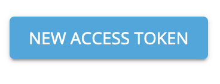
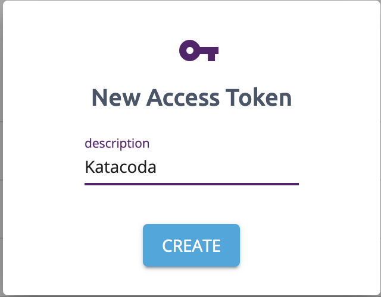
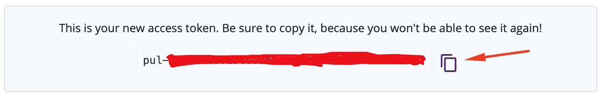

Before we get started creating Pulumi resources, we first need to login to the Pulumi SaaS to store our state.

If you're coming here from the introductory scenario and wondering why we need to login again - we're in a new Katacoda machine!

Let's get logged in!

## Login

Login to pulumi using the `login` command:

`pulumi login`{{excute}}

Your terminal window should be prompting you for a token. Visit [this page](https://app.pulumi.com/account/tokens) to create a token.

Click the blue `NEW ACCESS TOKEN` button in the top right of the main window.

Give your token a name, for example `katacoda`:

Then copy the token generated into using the clipboard icon.

You should now be logged in to the Pulumi SaaS.

## Verify

Verify you're logged in correctly by using the `whoami` command:

`pulumi whoami`{{execute}}

It should return your pulumi username.
