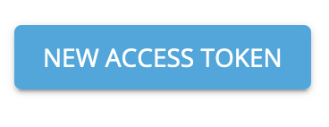
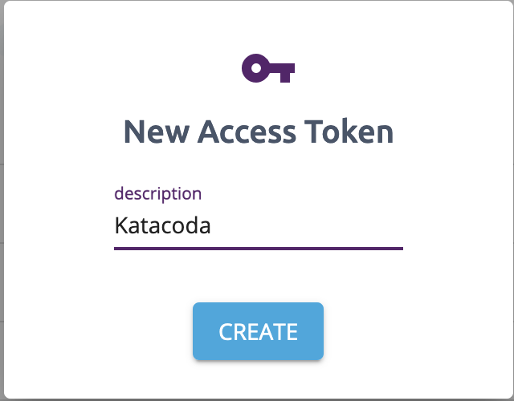

Once we have installed the Pulumi CLI, we now need to login to a [backend](https://www.pulumi.com/docs/intro/concepts/state/)

Pulumi creates infrastructure by making calls directly to cloud provider APIs. You define the infrastructure you'd like to create in your favourite programming language, the Pulumi CLI will then interpret that code and create the infrastructure you've defined. The status of those cloud provider API calls is then stores in a _state backend_. In order for Pulumi to work correctly, you'll need to "login" to a state backend.

## Create an account

Pulumi offers free state storage for individuals, and paid plans for teams and enterprise customers. Before you login, you'll need to sign up for a Pulumi account [here](https://app.pulumi.com/).

Once you've done that, you can login and get started with Pulumi!

## Login

Logging in is as simple as running the following command:

`pulumi login`{{execute}}

If you're running these commands locally on your laptop, pulumi will open a new browser window and prompt you to login. In this interactive tutorial, we'll need to generate a login key.

You'll see pulumi prompt you to open a [page](https://app.pulumi.com/account/tokens) to create a token.

Click the blue `NEW ACCESS TOKEN` button in the top right of the main window.

Give your token a name, for example `katacoda`:

Then copy the token generated into using the clipboard icon.

[!Copy Token](./assets/copy-token.png)

You should now be logged in to the Pulumi SaaS.

## Verify

Verify you're logged in correctly by using the `whoami` command:

`pulumi whoami`{{execute}}

It should return your pulumi username.
